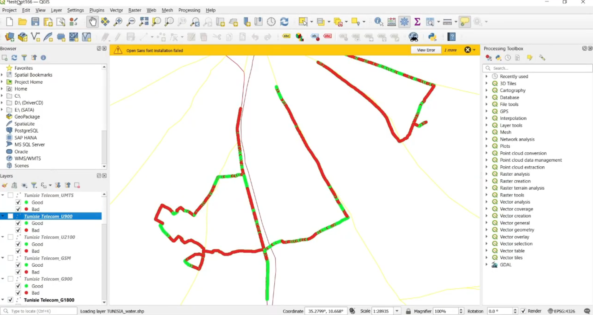

# Mobile Network Analysis Project
## Overview
This project focuses on analyzing mobile network quality data for a specific region by converting data from Excel to CSV, creating a geographical map in QGIS, and visualizing the mobile network quality using various thresholds. The project contains three main scripts:
1. excel_to_csv.py: Converts an Excel file containing mobile network data to a CSV format.
2. create_map_tunisia.py: Creates a map of Tunisia in QGIS.
3. create_doc.py: Projects the mobile network quality data points on the map, applying appropriate thresholds for visualization.
Her's the final result in QGIS:

## Project Structure

mobile_network_analysis:

1. excel_to_csv.py           # Script to convert Excel to CSV
2. create_map_tunisia.py     # Script to create the map of Tunisia in QGIS
3. create_doc.py              # Script to visualize mobile network quality on the map

## Requirements
- Python 3.x
- QGIS 3.38 (with Python support)
- Required Python libraries:
  - pandas
  - openpyxl (for Excel file handling)
  - PyQt5 (for file dialogs, if needed)
## Installation
1. Clone the repository:
   ```bash
   git clone https://github.com/yourusername/mobile_network_analysis.git
   cd mobile_network_analysis
   ```
2. Install required libraries:
   ```bash
   pip install pandas openpyxl PyQt5
   ```
3. Ensure QGIS is installed and configured correctly on your system. Adjust the script paths in `create_map_tunisia.py` and `create_doc.py` to point to your QGIS installation.
Usage
1. Convert Excel to CSV
Run the `excel_to_csv.py` script to convert your Excel file containing mobile network data into a CSV file.
```bash
python excel_to_csv.py
```
Make sure to provide the correct path to your Excel file in the script.
2. Create a Map of Tunisia
Use the `create_map_tunisia.py` script to create a geographical map of Tunisia in QGIS.
```bash
python create_map_tunisia.py
```
This script will load the necessary layers and set up the map layout.
3. Visualize Mobile Network Quality
Finally, run the `create_doc.py` script to visualize the points of different captured power levels on the map based on the thresholds defined in your CSV file.
```bash
python create_doc.py
```
This script reads the CSV file and projects the points on the map, allowing you to analyze the mobile network quality visually.

